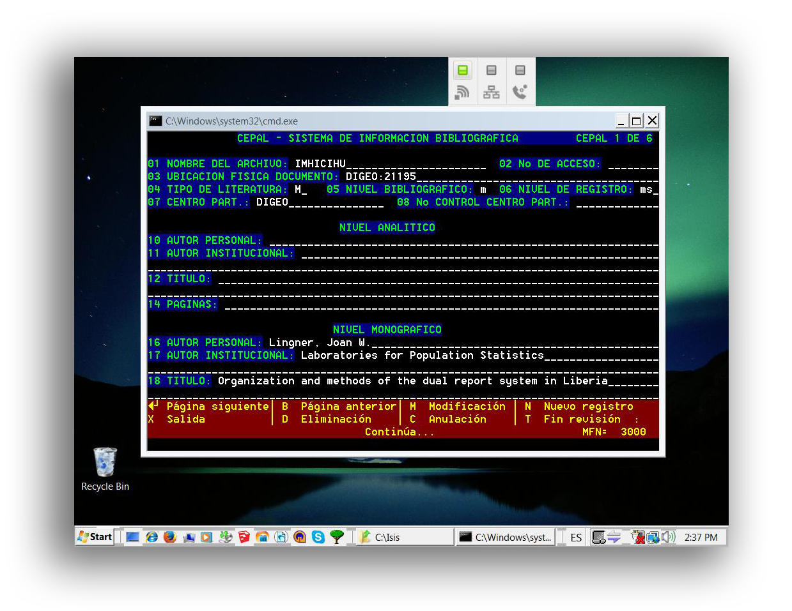
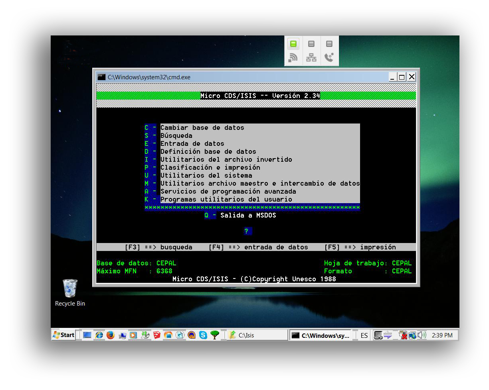
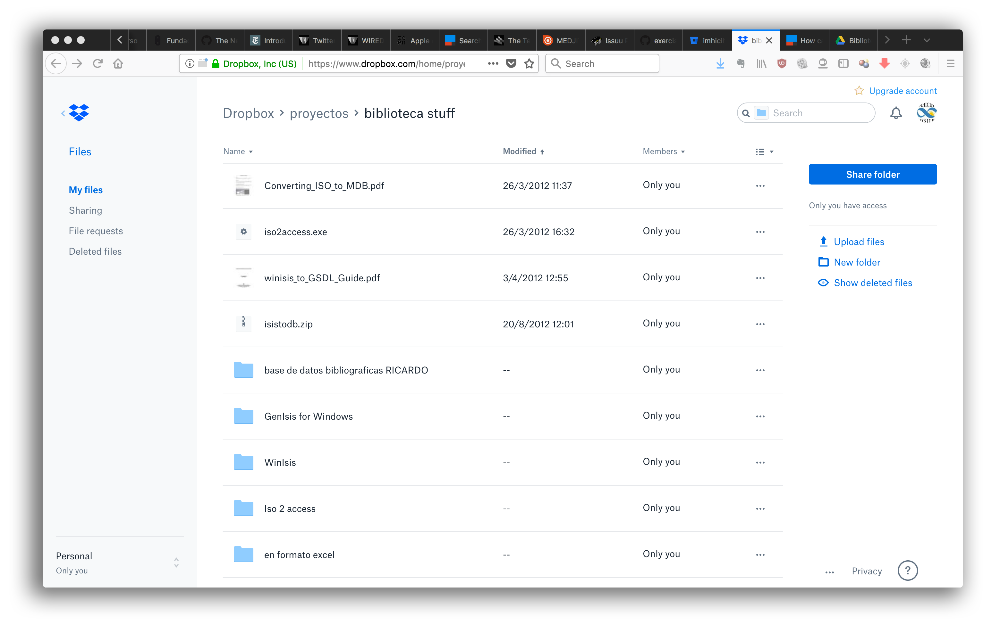
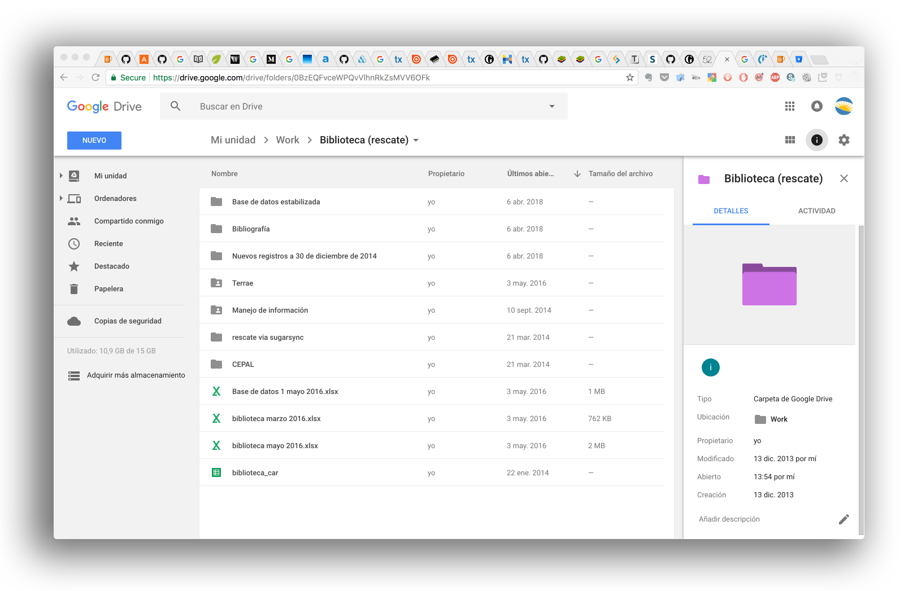
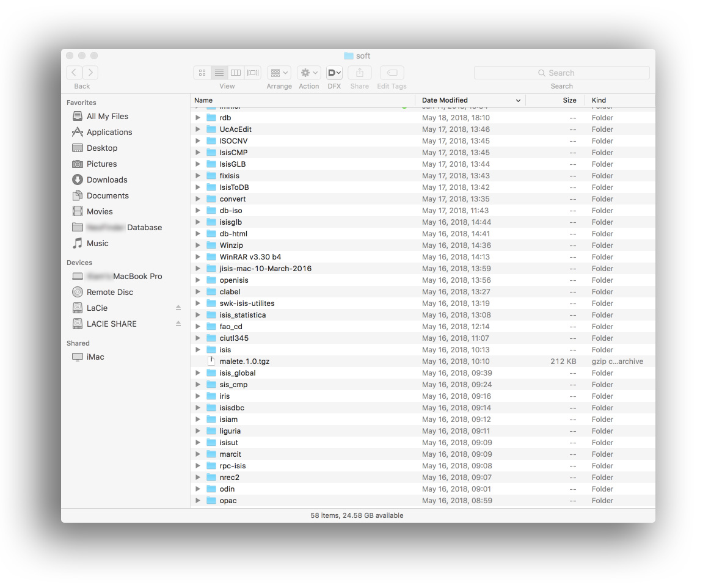

# Rationale #

* This file describes the workflow of migration between some various exogenous databases that belongs to IMHICIHU. 
* There are some work-around, collateral facts: some software are deprecated, so, there is no help or support to them

### What is this repository for? ###

* Quick summary
	- Migration between various databases and the fixes applied to minimize incompatibilities between parties
	
	

### How do I get set up? ###

* Summary of set up
    - Microsoft Windows XP (operating system)
    - [WinIsis](http://wiki.bireme.org/es/index.php/CDS-ISIS_for_Windows) (bibliographic database cataloger)
	- [VirtualBox](https://www.virtualbox.org/wiki/Downloads) (software to virtualize one operating system inside another operating systems)
	- [Beautiful Soap](https://www.crummy.com/software/BeautifulSoup/#Download): unencoding of unicode text to UTF-8 format specification. A kind of swiss-army knife of encoding-unencoding text files. 
	- [Text Compare!](https://text-compare.com/) (online diff tool that allows you to easily make a text comparison and find the differences between two texts)
	- [Docker](https://www.docker.com/): deploy apps inside virtual environments. A time-saver in the process of cut and paste in-from a myriad of applications between different operating systems.
	
* Dependencies
     - In terms of workflow, there is a previous repository: [Terrae database](https://bitbucket.org/imhicihu/terrae-database)

### Related repositories ###

* Some repositories linked with this project:
     - [Terrae database](https://bitbucket.org/imhicihu/terrae-database/src/master/)
     - [Bibliographical Searcher - Standalone app](https://bitbucket.org/imhicihu/bibliographical-searcher-stand-alone-app/)
     - [Bibliographic data on iOS devices](https://bitbucket.org/imhicihu/bibliographic-data-on-ios-devices/)
     - [IMHICIHU Digital repository](https://bitbucket.org/digital_repository/imhicihu-digital-repository/)

### Issues ###

* Can be seen [here](https://bitbucket.org/imhicihu/bibliographical-database-migration/issues)

### Changelog ###

* Please check the [Commits](https://github.com/imhicihu/bibiliographical-database-migration/commits/master) section for the current status

### Who do I talk to? ###

* Repo owner or admin
	- Contact at `imhicihu` at `gmail` dot `com`

### Code of Conduct

* Please, check our [Code of Conduct](code_of_conduct.md)

### Legal ###

* All trademarks are the property of their respective owners. 